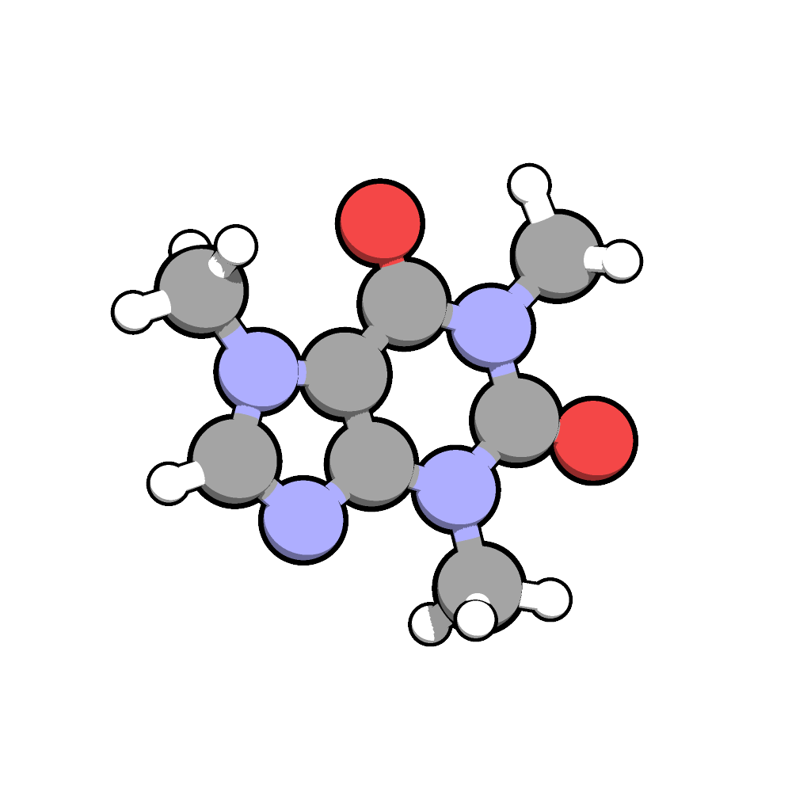

# Compound Information Retrieval and Visualization
This Python script utilizes PubChemPy and RDKit to retrieve information about a specified compound and visualize its molecular structure.

# Requirements
- Make sure you have the required Python libraries installed. You can install them using the following commands:

```bash
pip install pubchempy
pip install rdkit-pypi
```
- Ensure that you have an active internet connection as the script relies on PubChem to fetch compound information. 
- Additionally, RDKit requires additional dependencies for visualization, so make sure your environment is properly set up.

# Usage
Open a Python environment in your terminal or command prompt.

Copy and paste the code to retrieve information about a compound named "caffeine" e.g.

The script retrieves information such as molecular formula, molecular weight, IUPAC name, synonyms, and SMILES representation for the specified compound ("caffeine").

Run the script, and the information about the compound will be displayed, including its molecular structure.

```bash
Molecular formula: C8H10N4O2
Molecular weight: 194.19 g/mol
IUPAC Name: 1,3,7-trimethylpurine-2,6-dione
['caffeine', '58-08-2', 'Guaranine']
```


```bash
SMILES: CN1C=NC2=C1C(=O)N(C(=O)N2C)C
```
## Enhanced Visualization
For a more engaging visualization of the molecule:

- Download and install the Avogadro program from [Avogadro Website](https://avogadro.cc).

- Open Avogadro and insert the SMILES representation obtained from the script into the program.

- Optimize the geometry of the molecule within Avogadro.

- Export the optimized molecule in .pdb format.

- Download and install the Qutemol program from [Qutemol Website](https://qutemol.sourceforge.net).

- Open Qutemol and load the exported .pdb file.

- Make any necessary modifications to enhance the visualization of the molecule in Qutemol.


